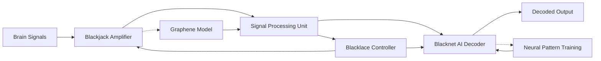

# Blacklace – Modular BCI Framework
> Decode silent thoughts into action.
> A full-stack Brain-Computer Interface (BCI) system engineered from scratch, powered by simulated graphene amplification and modular AI decoding. Designed to function without lab-grade resources, pushing the boundaries of accessible neurotechnology.

---

## Background & Origin

Blacklace began as an ambitious experiment: to simulate a **graphene-based amplifier** capable of enhancing brainwave signals using open-source tools. Inspired by graphene's sensitivity and potential in bioelectronics, the project aimed to digitally recreate its properties and use that model to amplify low-power EEG signals.

As the simulation evolved, the vision expanded: rather than one monolithic system, Blacklace would become a **modular, end-to-end BCI framework**—flexible enough to slot into existing systems, scalable across different neural signal types, and powerful enough to support AI-driven decoding.

This modular vision gave rise to:
- **Blackjack** – the signal amplifier module
- **Blacknet** – the decoder module

Each piece now operates independently but can integrate into a streamlined pipeline—from raw EEG to AI-understood intent.

Previously this project was named BCI_graphene_prototype now that has give rise to this version you can still read the previous ReadMe in project Blackjack.

---
## Mission Statement

**Blacklace** is a boundary-pushing brain-computer interface (BCI) architecture that reimagines neural signal acquisition and interpretation through a graphene-inspired amplifier framework and modular AI decoding. 

Born from a fusion of theoretical physics, material science, and cognitive technology, Blacklace aims to build an open, scalable, and biologically-conscious pathway between brain activity and digital systems—unlocking new possibilities for neurotechnology, communication, and human-computer symbiosis.

---

## Repository Structure

<pre>
Blacklace/
├── README.md                        # This file
├── blackjack/                       # Graphene-based signal amplifier
│   ├── Amp-files                    # Phase 1 & 2 code
│   ├── Images                       # Signal graphs & SNR plots
│   └── Notes                        # Progress Summary and plan details
├── blacknet/                        # Planned AI decoder (neural intent)
│   ├── architecture_outline.md
│   └── decoder_model_wip.ipynb
├── data/                            # EEG datasets (synthetic + real)
│   └── sample_eeg.csv
├── vault/                           # Raw notes, experiments, sketches
└── Research_Logs/
    └── Blacklace_Theory_Log.pdf
</pre>

---

## System Architecture

Blacklace is structured into three core modules, each serving a distinct function within the BCI pipeline:

### 1. **Blackjack** – Graphene-Based Neural Amplifier
A modular, biologically-aware amplifier designed to boost raw neural signals with minimal distortion. Inspired by the electrical and quantum behavior of graphene, Blackjack aims to create a low-noise, high-gain signal interface between the brain and hardware.

### 2. **Blacknet** – AI-Powered Signal Decoder *(Planned)*
An adaptive neural decoding engine that uses deep learning to interpret amplified brain signals into meaningful output. Blacknet will learn from individual neural patterns, enabling personalized and accurate BCI control.

### 3. **Blacklace** – Integrated BCI Framework
The overarching system that connects Blackjack and Blacknet, handling signal flow, system calibration, and future real-time communication features. Blacklace is designed to be scalable, open-source, and modular—ready to adapt to future research and experimental needs.

## System Architecture Diagram

---

## Phase Status

| Module    | Phase        | Status         |
|-----------|--------------|----------------|
| Blackjack | Phase 1      | ✅ Complete     |
| Blackjack | Phase 2      | ⏳ Finalizing visuals |
| Blacknet  | Phase 1 (Arch) | 🧠 In design   |

---

## Vision
To create a fully modular BCI system that works **without invasive hardware** or expensive lab setups — making brain-computer interaction open, lightweight, and powerful.

---

## License
This project is released under a **Non-Commercial License (CC BY-NC 4.0)**. You are free to use, share, and adapt the code and ideas for non-commercial purposes with attribution. For commercial use or licensing inquiries, please contact the author.
Contact: pranavr399@gmail.com

---

## Author & Contact
Built by **Pranav Rathod**, age 19 – independent theorist & builder.

Email: pranavr399@gmail.com

> "Let the mind speak — and the machine listen."

---

*Phase 2 visuals and Blacknet draft coming soon.*

