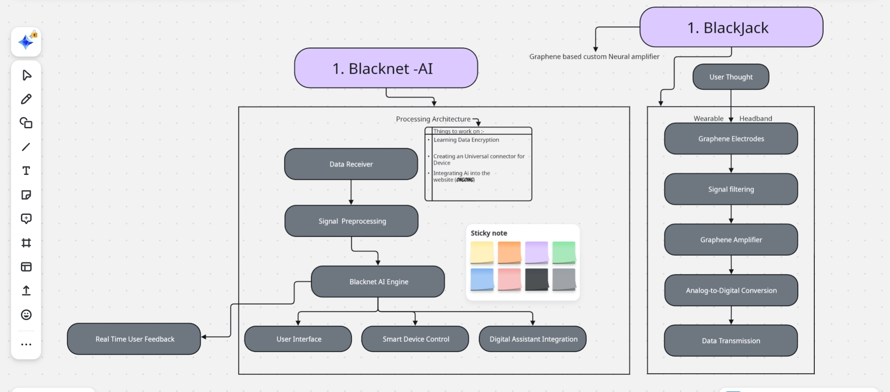
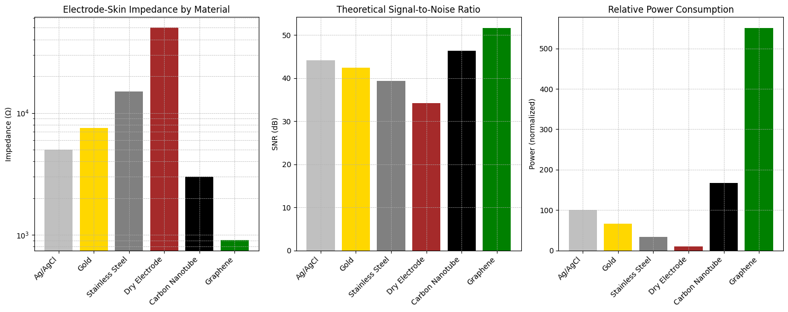

# Blacklace
> Decode silent thoughts into action.
 > A full-stack Brain-Computer Interface (BCI) system engineered from scratch, powered by simulated graphene amplification and modular AI decoding. Pushing the boundaries of accessible neurotechnology.
---
## Index

1. [The Dawn of Thought-Native Technology](#the-dawn-of-thought-native-technology)
2. [Vision](#vision)
3. [What Is Blacklace?](#what-is-blacklace)
4. [Core Technologies](#core-technologies)
   - [Blackjack — The Guardian of Thought](#1-blackjack--the-guardian-of-thought)
   - [Blacknet — Your AI Co-Pilot](#2-blacknet--your-ai-co-pilot)
5. [Revolutionary Capabilities](#revolutionary-capabilities)
6. [Repository Structure](#repository-structure)
7. [Documentation and Guides](#documentation-and-guides)
8. [Beyond Technology: A Movement](#beyond-technology-a-movement)
9. [Join Us](#join-us)
10. [Investor Guide](#investor-guide)
11. [Getting started](#getting-started)

## The Dawn of Thought-Native Technology

> "The most powerful technology in the world is the human mind. What if we could finally let it speak—not through fingers or voice, but through thought?"

Blacklace isn't just another product. It's the culmination of humanity's quest to truly connect with technology—where the boundary between human intention and digital reality disappears.

## Vision

For too long, we've been trapped behind layers of abstraction: keyboards, touchscreens, voice commands. Each innovation brought us closer, but none achieved true symbiosis.

Blacklace breaks that final barrier.

We're not building another interface. We're eliminating the interface altogether.

## What Is Blacklace?

Blacklace is the world's first Thought-Native Operating System—an adaptive ecosystem that interfaces directly with your brain. It doesn't require you to learn its language; it learns yours.

- It listens when you think
- It responds without sound
- It protects your privacy with uncompromising vigilance
- It evolves alongside you

This isn't just a Brain-Computer Interface. This is the future of human-machine symbiosis.

## Core Technologies

### 1. Blackjack — The Guardian of Thought

At the foundation of Blacklace is our revolutionary graphene-based signal amplifier, designed to capture neural signals with unprecedented clarity:

- **Graphene superiority**: One atom thick, 200x stronger than steel, exceptional conductivity
- **Electromagnetic shielding**: Protects brain signals from external interference
- **Non-invasive design**: No surgery, no discomfort, complete discretion
- **Adaptive filtering**: Isolates intentional signals from background neural activity

Blackjack doesn't just read your brain—it creates a sanctuary for your thoughts.

### 2. Blacknet — Your AI Co-Pilot

Blacknet transforms neural signals into meaningful interaction:

- **Intent-based operation**: Responds to thoughts, not commands
- **Contextual awareness**: Understands your emotional state and environment
- **Proactive assistance**: Anticipates needs before you fully form the thought
- **Bone-conduction feedback**: Delivers responses directly through skull vibration

## Revolutionary Capabilities

### Bulletproof Security. Privacy by Design.
Your thoughts are sacred. Blacklace's multilayered defense system ensures they remain yours alone.

### Effortless Integration. Infinite Possibilities.
Control your entire digital ecosystem with a thought. No more tapping, swiping, or speaking.

### A New Frontier in Medicine
Early detection of neurological conditions, assistance for those with speech impediments, and a breakthrough tool for mental health monitoring.

### A Personalized Intelligence
Not just an assistant, but a companion that forms a genuine bond with your mind.

## Repository Structure

<pre>
Blacklace/
├── README.md                                  # Main project overview and introduction
├── WHITEPAPER.md                              # Full whitepaper 
├── docs/                                       # Documentation
│   ├── architecture.md                         # System architecture overview
│   ├── graphene_amplifier.md                   # Graphene-based signal amplifier (Blackjack)
│   ├── blackjack_module.md                     # Modular amplifier system details
│   ├── eeg_acquisition.md                      # EEG signal acquisition system
│   ├── ai_decoding.md                          # Blacknet AI decoding engine documentation
│   ├── privacy_framework.md                    # Privacy and data security framework
│   └── competitive_analysis.md                 # Analysis of competing technologies
├── research/                                   # Research materials and references
│   ├── literature_review.md                    # Summary of related research
│   └── references.bib                          # Bibliography in BibTeX format
├── code/                                       # Source code
│   ├── simulations/                            # Simulations
│   │   ├── graphene_amplifier.py               # Graphene amplifier (Blackjack) simulation
│   │   └── eeg_processing.py                   # Signal preprocessing and feature extraction
│   ├── blackjack/                              # Modular amplifier system code
│   │   ├── hardware_interface.py               # Simulated interface to EEG hardware
│   │   └── signal_routing.py                   # Signal routing logic
│   ├── blacknet/                               # AI model for EEG-to-intent decoding
│   │   ├── model.py                            # Neural network model
│   │   └── training.py                         # Model training code
│   └── prototype/                              # Integration prototype code
│       └── bci_interface.py                    # Core interface logic
├── media/                                      # Visuals and media
│   ├── architecture_diagram.png                # Overall system diagram
│   ├── bci_comparison.png                      # Chart comparing BCI technologies
│   └── blacklace_concept.png                   # Conceptual rendering
└── LICENSE                                     # Open source license
</pre>


---
## System Architecture

Blacklace is structured into three core modules, each serving a distinct function within the BCI pipeline:

### 1. **Blackjack** – Graphene-Based Neural Amplifier
A modular, biologically-aware amplifier designed to boost raw neural signals with minimal distortion. Inspired by the electrical and quantum behavior of graphene, Blackjack aims to create a low-noise, high-gain signal interface between the brain and hardware.

### 2. **Blacknet** – AI-Powered Signal Decoder *(Planned)*
An adaptive neural decoding engine that uses deep learning to interpret amplified brain signals into meaningful output. Blacknet will learn from individual neural patterns, enabling personalized and accurate BCI control.

### 3. **Blacklace** – Integrated BCI Framework
The overarching system that connects Blackjack and Blacknet, handling signal flow, system calibration, and future real-time communication features. Blacklace is designed to be scalable, open-source, and modular—ready to adapt to future research and experimental needs.

## System Architecture Diagram


---

## Phase Status

| Module    | Phase        | Status         |
|-----------|--------------|----------------|
| Blackjack | Phase 1      | ✅ Complete     |
| Blackjack | Phase 2      | ⏳ Finalizing visuals |
| Blacknet  | Phase 1 (Arch) | 🧠 In design   |

---
## Latest Journal

- [May 4, 2025](docs/Daily_logs/2025-05-04.md)
*Waiting for logs...*

---

## 📊 Material Update: Graphene Composite

Recent testing revealed unexpected results when transitioning from pure graphene to our composite graphene material:

- ✅ **Lower Impedance**: ~800Ω (vs ~30kΩ for pure graphene)
- ✅ **Higher SNR**: 51dB, outperforming all tested alternatives
- ⚠️ **Surprising Power Draw**: 5x higher power consumption than traditional electrodes

See detailed analysis in our [graphene amplifier documentation](https://github.com/PranavRathod399/Blacklace/blob/main/docs/graphene_amplifier.md).

We're investigating the power consumption anomaly while leveraging the superior electrical properties for high-fidelity biosignal applications.
---

## Documentation and Guides

| Resource | Description |
|----------|-------------|
| [Whitepaper]([Whitepaper].pdf) | Comprehensive technical specifications and research foundation |
| [Architecture Overview](docs/architecture.md) | System design and component interaction |
| [Blackjack Module](docs/blackjack_module.md) | Graphene-based signal amplification technology |
| [EEG Acquisition](docs/eeg_acquisition.md) | Neural signal capture methodology |
| [AI Decoding Engine](docs/ai_decoding.md) | Blacknet's neural interpretation system |
| [Privacy Framework](docs/privacy_framework.md) | Our approach to neural data security |
| [Competitive Analysis](docs/competitive_analysis.md) | How Blacklace redefines the BCI landscape |

## Beyond Technology: A Movement

Every other BCI is trying to translate your brain into a language technology understands. Blacklace teaches technology to speak *your* language.

We're not building an interface. We're building a relationship.  
We're not creating a tool. We're ushering in post-human evolution.

This is about amplifying what makes us human—our thoughts, our choices, our creativity.

## Join Us

Welcome to a world where intention is all that matters. Where your thoughts shape your reality. Where your digital self is a true reflection of your soul.

This is Blacklace. This is the beginning.

Are you ready to think your world into existence?

## Investor Guide

### Welcome to the Next Evolution of Human-Machine Interaction

This section is crafted for investors, research partners, and institutional reviewers seeking to understand the transformative potential of Blacklace and our strategic roadmap.

---

### 1. Where to Begin Your Journey

- [**README.md**](README.md) – The vision, philosophy, and capabilities of Blacklace
- [**WHITEPAPER.pdf**]([Whitepaper].pdf) – Technical foundation, systems architecture, and development roadmap

---

### 2. Essential Technical Documentation

| Document | Purpose |
|----------|---------|
| [Architecture Overview](docs/architecture.md) | System design and integration framework |
| [Graphene Amplifier Technology](docs/graphene_amplifier.md) | The science behind our revolutionary Blackjack module |
| [AI Neural Decoding](docs/ai_decoding.md) | How Blacknet transforms neural patterns into digital intent |
| [Privacy & Security Framework](docs/privacy_framework.md) | Our approach to safeguarding neural data |
| [Market Analysis](docs/competitive_analysis.md) | Blacklace's position in the emerging BCI landscape |

---

### 3. Technical Demonstrations

Our codebase provides simulations and prototypes that demonstrate key concepts:

- [**Signal Simulation**](code/simulations/) – Mathematical models of neural signal acquisition and enhancement
- [**Neural Network Model**](code/blacknet/) – AI architecture for intent interpretation
- [**Integration Prototype**](code/prototype/bci_interface.py) – End-to-end system simulation

---

### 4. Visual Resources

| Visualization | Content |
|---------------|---------|
| [System Architecture](media/architecture_diagram.png) | Complete system flow and component interaction |
| [Concept Visualization](media/blacklace_concept.png) | Artistic representation of the Blacklace experience |
| [Competitive Landscape](media/bci_comparison.png) | How Blacklace redefines the market |

---

### 5. Strategic Review Path

For maximum insight and efficiency, we recommend this exploration sequence:

1. Begin with [**README.md**](README.md) and [**WHITEPAPER.pdf**]([Whitepaper].pdf) for the complete vision
2. Explore the technical architecture in [**docs/**](docs/)
3. Examine our visual assets in [**media/**](media/)
4. Review our prototypes and simulations in [**code/**](code/)
5. Understand our market position via [**competitive_analysis.md**](docs/competitive_analysis.md)

---

### 6. Connect With Us

For investment opportunities, partnerships, or detailed presentations:

- **Email:** pranavr399@gmail.com  
- **GitHub:** [@PranavRathod399](https://github.com/PranavRathod399)

---

*Thank you for your interest in Blacklace — where human thought transcends the digital frontier.*

---
## Getting Started

### Prerequisites
- Python 3.8+
- Required packages: `numpy`, `scipy`, `matplotlib`, `pytorch`, `pandas`
- Basic understanding of EEG signals and neural networks

### Installation

1. Clone the Blacklace repository:
   ```bash
   git clone https://github.com/PranavRathod399/Blacklace.git
   cd Blacklace
   ```

2. Set up virtual environment (recommended):
   ```bash
   python -m venv venv
   source venv/bin/activate  # On Windows: venv\Scripts\activate
   ```

3. Install dependencies:
   ```bash
   pip install -r requirements.txt
   ```

---

### Quick Start Guide

#### Running Simulations
Try the graphene amplifier simulation:
```bash
python code/simulations/graphene_amplifier.py
```

#### Exploring the Blackjack Module
Test the Blackjack module:
```bash
python code/blackjack/hardware_interface.py --simulate
```

#### Simple Signal Processing Demo
```bash
python code/simulations/eeg_processing.py --demo
```

---

### Example Usage

```python
from blacklace.blackjack import SignalAmplifier
from blacklace.blacknet import ModelInterface

# Initialize the amplifier
amplifier = SignalAmplifier(channels=8, sampling_rate=250)

# Process sample data
processed_signal = amplifier.process(raw_signal)

# Decode signal
decoder = ModelInterface(model_path="models/starter_model.pt")
intent = decoder.decode(processed_signal)

print(f"Detected intent: {intent}")
```

---

### Development Setup

For those looking to contribute:

1. Install development dependencies:
   ```bash
   pip install -r requirements-dev.txt
   ```

2. Setup pre-commit hooks:
   ```bash
   pre-commit install
   ```

3. Run tests:
   ```bash
   pytest
   ```

---

### Troubleshooting

- **Signal noise issues**: Check system grounding and increase `noise_reduction` parameter.
- **Model training failures**: Ensure training data is normalized.
- **Hardware connection errors**: Verify USB connections and permissions.

Need more help? [Open an issue](https://github.com/PranavRathod399/Blacklace/issues) or contact us directly.

---
© Blacklace Technologies | [License](LICENSE)

> "Let the mind speak — and the machine listen."

---

*Phase 2 visuals and Blacknet draft coming soon.*

