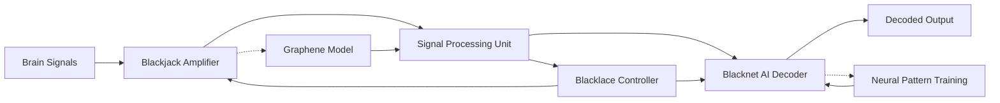

# Blacklace

## Index

1. [The Dawn of Thought-Native Technology](#the-dawn-of-thought-native-technology)
2. [Vision](#vision)
3. [What Is Blacklace?](#what-is-blacklace)
4. [Core Technologies](#core-technologies)
   - [Blackjack — The Guardian of Thought](#1-blackjack--the-guardian-of-thought)
   - [Blacknet — Your AI Co-Pilot](#2-blacknet--your-ai-co-pilot)
5. [Revolutionary Capabilities](#revolutionary-capabilities)
6. [Repository Structure](#repository-structure)
7. [Documentation and Guides](#documentation-and-guides)
8. [Beyond Technology: A Movement](#beyond-technology-a-movement)
9. [Join Us](#join-us)
10. [Investor Guide](#investor-guide)

## The Dawn of Thought-Native Technology

> "The most powerful technology in the world is the human mind. What if we could finally let it speak—not through fingers or voice, but through thought?"

Blacklace isn't just another product. It's the culmination of humanity's quest to truly connect with technology—where the boundary between human intention and digital reality disappears.

## Vision

For too long, we've been trapped behind layers of abstraction: keyboards, touchscreens, voice commands. Each innovation brought us closer, but none achieved true symbiosis.

Blacklace breaks that final barrier.

We're not building another interface. We're eliminating the interface altogether.

## What Is Blacklace?

Blacklace is the world's first Thought-Native Operating System—an adaptive ecosystem that interfaces directly with your brain. It doesn't require you to learn its language; it learns yours.

- It listens when you think
- It responds without sound
- It protects your privacy with uncompromising vigilance
- It evolves alongside you

This isn't just a Brain-Computer Interface. This is the future of human-machine symbiosis.

## Core Technologies

### 1. Blackjack — The Guardian of Thought

At the foundation of Blacklace is our revolutionary graphene-based signal amplifier, designed to capture neural signals with unprecedented clarity:

- **Graphene superiority**: One atom thick, 200x stronger than steel, exceptional conductivity
- **Electromagnetic shielding**: Protects brain signals from external interference
- **Non-invasive design**: No surgery, no discomfort, complete discretion
- **Adaptive filtering**: Isolates intentional signals from background neural activity

Blackjack doesn't just read your brain—it creates a sanctuary for your thoughts.

### 2. Blacknet — Your AI Co-Pilot

Blacknet transforms neural signals into meaningful interaction:

- **Intent-based operation**: Responds to thoughts, not commands
- **Contextual awareness**: Understands your emotional state and environment
- **Proactive assistance**: Anticipates needs before you fully form the thought
- **Bone-conduction feedback**: Delivers responses directly through skull vibration

## Revolutionary Capabilities

### Bulletproof Security. Privacy by Design.
Your thoughts are sacred. Blacklace's multilayered defense system ensures they remain yours alone.

### Effortless Integration. Infinite Possibilities.
Control your entire digital ecosystem with a thought. No more tapping, swiping, or speaking.

### A New Frontier in Medicine
Early detection of neurological conditions, assistance for those with speech impediments, and a breakthrough tool for mental health monitoring.

### A Personalized Intelligence
Not just an assistant, but a companion that forms a genuine bond with your mind.

## Repository Structure

<pre>
Blacklace/
├── README.md                                  # Main project overview and introduction
├── WHITEPAPER.md                              # Full whitepaper 
├── docs/                                       # Documentation
│   ├── architecture.md                         # System architecture overview
│   ├── graphene_amplifier.md                   # Graphene-based signal amplifier (Blackjack)
│   ├── blackjack_module.md                     # Modular amplifier system details
│   ├── eeg_acquisition.md                      # EEG signal acquisition system
│   ├── ai_decoding.md                          # Blacknet AI decoding engine documentation
│   ├── privacy_framework.md                    # Privacy and data security framework
│   └── competitive_analysis.md                 # Analysis of competing technologies
├── research/                                   # Research materials and references
│   ├── literature_review.md                    # Summary of related research
│   └── references.bib                          # Bibliography in BibTeX format
├── code/                                       # Source code
│   ├── simulations/                            # Simulations
│   │   ├── graphene_amplifier.py               # Graphene amplifier (Blackjack) simulation
│   │   └── eeg_processing.py                   # Signal preprocessing and feature extraction
│   ├── blackjack/                              # Modular amplifier system code
│   │   ├── hardware_interface.py               # Simulated interface to EEG hardware
│   │   └── signal_routing.py                   # Signal routing logic
│   ├── blacknet/                               # AI model for EEG-to-intent decoding
│   │   ├── model.py                            # Neural network model
│   │   └── training.py                         # Model training code
│   └── prototype/                              # Integration prototype code
│       └── bci_interface.py                    # Core interface logic
├── media/                                      # Visuals and media
│   ├── architecture_diagram.png                # Overall system diagram
│   ├── bci_comparison.png                      # Chart comparing BCI technologies
│   └── blacklace_concept.png                   # Conceptual rendering
└── LICENSE                                     # Open source license
</pre>

---

## System Architecture

Blacklace is structured into three core modules, each serving a distinct function within the BCI pipeline:

### 1. **Blackjack** – Graphene-Based Neural Amplifier
A modular, biologically-aware amplifier designed to boost raw neural signals with minimal distortion. Inspired by the electrical and quantum behavior of graphene, Blackjack aims to create a low-noise, high-gain signal interface between the brain and hardware.

### 2. **Blacknet** – AI-Powered Signal Decoder *(Planned)*
An adaptive neural decoding engine that uses deep learning to interpret amplified brain signals into meaningful output. Blacknet will learn from individual neural patterns, enabling personalized and accurate BCI control.

### 3. **Blacklace** – Integrated BCI Framework
The overarching system that connects Blackjack and Blacknet, handling signal flow, system calibration, and future real-time communication features. Blacklace is designed to be scalable, open-source, and modular—ready to adapt to future research and experimental needs.

## System Architecture Diagram

---

## Phase Status

| Module    | Phase        | Status         |
|-----------|--------------|----------------|
| Blackjack | Phase 1      | ✅ Complete     |
| Blackjack | Phase 2      | ⏳ Finalizing visuals |
| Blacknet  | Phase 1 (Arch) | 🧠 In design   |

---

## Vision
To create a fully modular BCI system that works **without invasive hardware** or expensive lab setups — making brain-computer interaction open, lightweight, and powerful.

---

## License
This project is released under a **Non-Commercial License (CC BY-NC 4.0)**. You are free to use, share, and adapt the code and ideas for non-commercial purposes with attribution. For commercial use or licensing inquiries, please contact the author.
Contact: pranavr399@gmail.com

---

## Author & Contact
Built by **Pranav Rathod**, age 19 – independent theorist & builder.

Email: pranavr399@gmail.com

> "Let the mind speak — and the machine listen."

---

*Phase 2 visuals and Blacknet draft coming soon.*

